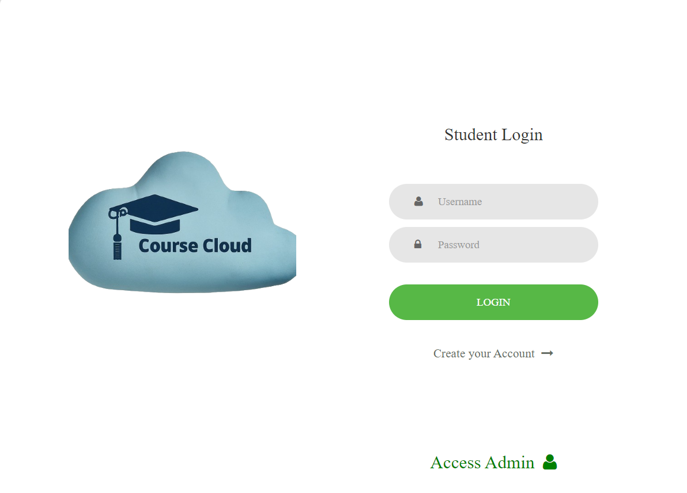
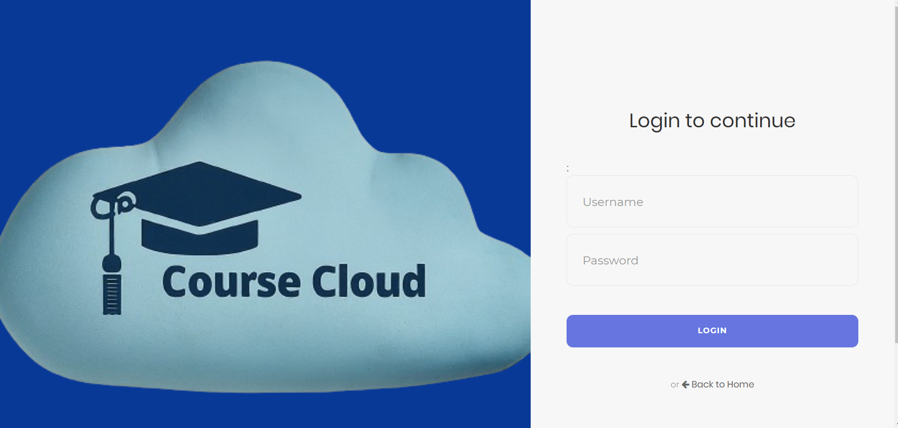
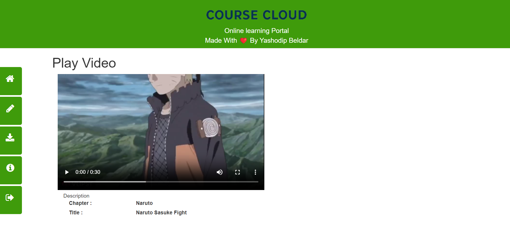
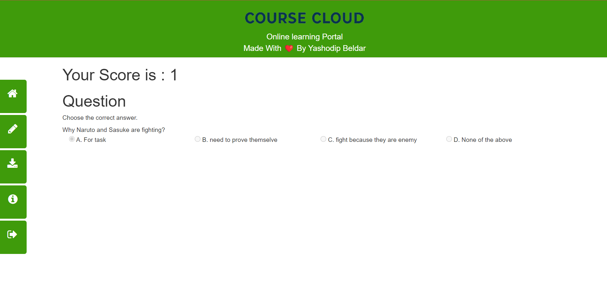
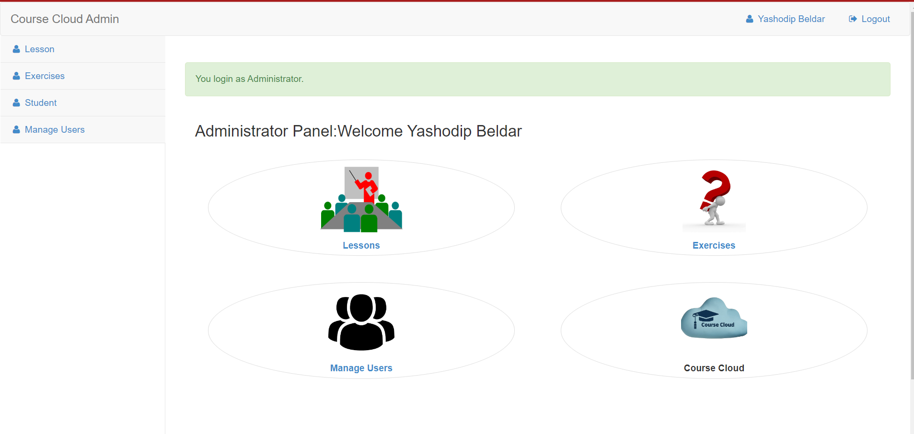
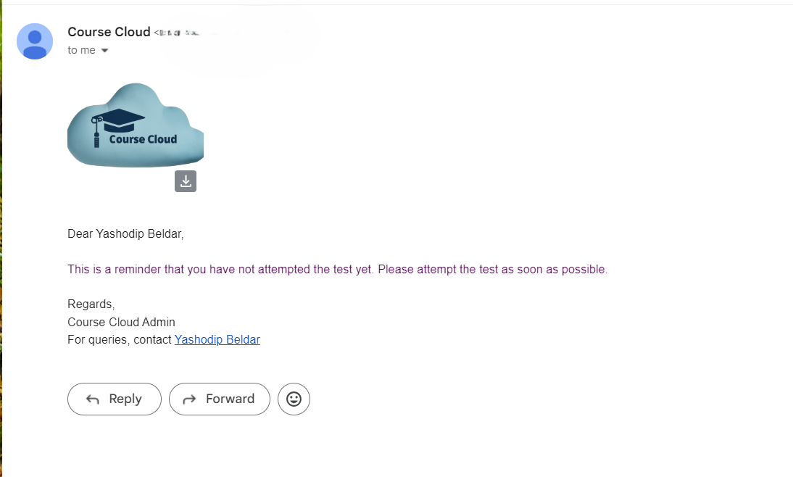

# EduLearn

## Overview
**Course Cloud** is an online learning platform where students can register, log in, and access educational resources such as videos and notes. Students can also complete exercises, view their marks, and download materials. The admin has full control over managing the content and can send emails to students based on their exercise completion.

## Features
- **Student Features:**
  - Register and log in to the platform.
  - View and download videos and notes.
  - Complete exercises based on the notes provided.
  - View marks and performance for completed exercises.
  - Receive email notifications from the admin.
  
- **Admin Features:**
  - Add, edit, and delete videos and notes.
  - Assign exercises to students.
  - Send email notifications to students' registered emails.
  - Manage student registrations and view.

## Tech Stack
- **Backend:** PHP
- **Frontend:** HTML, CSS, JavaScript
- **Database:** MySQL
- **Email Service:** PHPMailer

## Installation
1. Clone the repository:
    ```bash
    git clone https://github.com/Mr-Yash-beldar/Course-Cloud.git
    ```
2. Navigate to the project directory:
    ```bash
    cd Course-Cloud
    ```
3. Set up the database:
    - Create a new database in MySQL.
    - Import the `course-cloud.sql` file located in the `database` directory.
4. Configure the database connection:
    - Open the `include/config.php` file.
    - Update the database host, username, password, and database name.
5. Configure email settings :
    - Open the `admin/modules/modstudent/inform.php` file.
    - Update the SMTP server settings, including your email address and password.
6. Run the application on your local server:
    - Place the project folder in your server’s root directory (e.g., `htdocs` for XAMPP).
    - Start the server and open the application in your web browser.

## Screenshots

1. **Home Page:**
    
    - Screenshot showing the login and registration options.
 
2. **Admin Login:**
    
  - Screenshot showing the Admin Login of Course Cloud.

3. **Student Dashboard:**
    
    - Screenshot displaying the student’s dashboard after logging in, including access to videos, notes, and exercises.

4. **Video and Notes Page:**
    
    - Screenshot showing the list of available videos and notes that the student can view and download.

5. **Exercise and Result:**

    - Screenshot of the exercise page where students can complete and submit exercises.


6. **Admin Dashboard:**

    - Screenshot of the admin dashboard with options to manage content and students.

7. **Email Notification:**

    - Screenshot of an email notification received by a student.

## Contributing
If you want to contribute, please check out the [CONTRIBUTING.md](CONTRIBUTING.md) file for guidelines on reporting issues, suggesting enhancements, and submitting pull requests.

## License
This project is licensed under the MIT License - see the [LICENSE](LICENSE) file for details.

## Contact
For any inquiries, please contact [Yashodip Beldar](yashodipbeldar@gmail.com).

## Thanks to all the Contributors ❤️

<a href="https://github.com/Mr-Yash-beldar/Course-Cloud/graphs/contributors">
  
</a>

